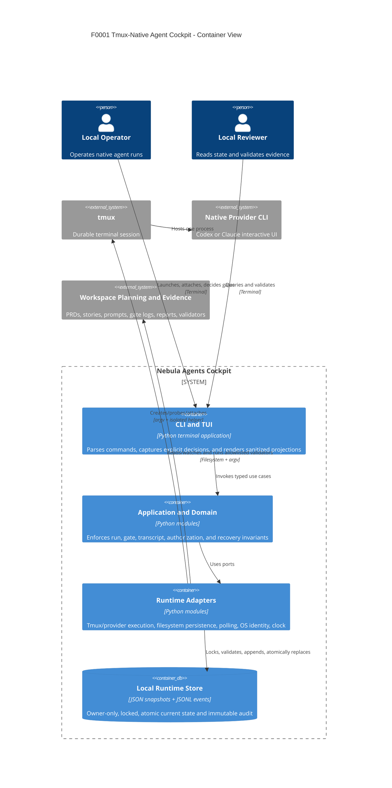

# Nebula Agents Container View



## Deployment Topology

All containers in the diagram are logical boundaries inside one local executable except the filesystem store and external processes. There is no Docker or server deployment requirement for F0001. A TUI exit must leave tmux and its provider child alive.

## Dependency Direction

```text
CLI/TUI -> Application -> Domain
             ^
             |
          Adapters
```

Adapters implement application-owned ports. Presentation cannot call adapters directly.
