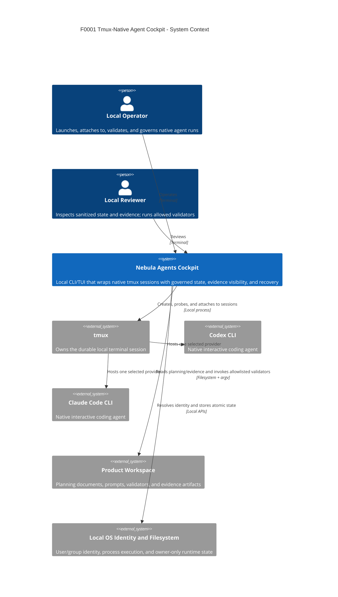

# Nebula Agents System Context

## Boundary Notes

- Provider login and provider tool approvals stay inside the native CLI.
- Lifecycle gate approval is a separate explicit Nebula action and cannot be inferred from provider screen output.
- No network service, cloud data store, remote collaborator, or managed provider adapter exists in F0001.
- F0003 and F0002 may add surfaces around this system but must preserve direct tmux attach as fallback until parity is proven.
