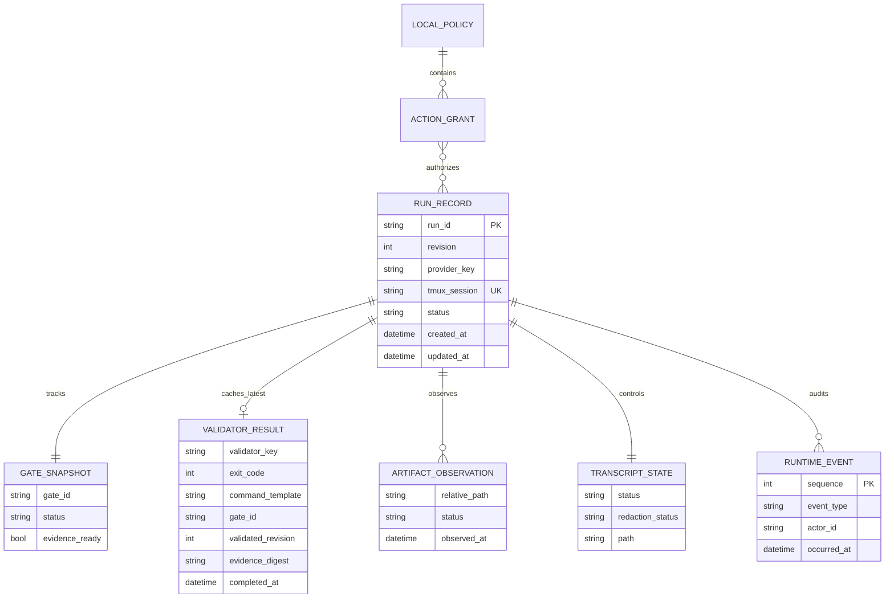

# Nebula Agents Local Runtime Data Model

## Scope

This model covers F0001 local state only. It is filesystem-backed and single-host. F0003 may add an artifact index, summaries, metrics, and learning records without changing the F0001 run identity contract.

## Aggregate and Record Model

| Record | Identity | Purpose | Mutability |
|--------|----------|---------|------------|
| `RunRecord` | `run_id` | Aggregate snapshot for one native provider run | Atomic replacement; revision increases by one |
| `GateSnapshot` | `(run_id, gate_id)` | Current gate eligibility and status | Replaced only through guarded transitions |
| `ValidatorResult` | `(run_id, gate_id, validator_key, completed_at)` | Latest validator projection, safe command template, validated revision, and evidence digest | Latest projection replaces; full history stays in events/artifacts |
| `ArtifactObservation` | `(run_id, relative_path)` | Last observed evidence state | Replaced by watcher reconciliation |
| `TranscriptState` | `run_id` | Capture, redaction, path, and preview status | Guarded state transitions |
| `RuntimeEvent` | `(run_id, sequence)` | Immutable audit/timeline evidence | Append-only |
| `ProviderProbe` | `(provider_key, probed_at)` | Non-secret readiness result | Replaceable diagnostic record |
| `LocalPolicy` | `policy_version` | OS identity to role/action grants | Atomic replacement after validation |

## RunRecord Fields

| Field | Type | Rules |
|-------|------|-------|
| `schema_version` | string | `1.0` for the initial contract |
| `revision` | integer | Starts at 0; increments exactly once per successful snapshot mutation |
| `run_id` | string | `YYYY-MM-DD-8hex`; unique in the runtime directory |
| `feature_id` | string | `F####`; must resolve to a feature planning folder |
| `story_id` | string/null | `F####-S####`; when present, feature prefix must match |
| `provider_key` | enum | `codex` or `claude` in F0001 |
| `tmux_session` | string | `nebula-F####-8hex`; unique among nonterminal runs |
| `workspace_root` | absolute path | Canonical directory containing `planning-mds/features` |
| `prompt_contract` | path | Canonical file inside approved workspace/framework roots |
| `prompt_action` | enum | `plan`, `feature`, `build`, `review`, or `validate` |
| `status` | enum | `PreflightPending`, `Launching`, `Active`, `DetachedOrExited`, `Failed`, `Exited`, `Unknown` |
| `owner` | object | OS UID and resolved username; display label optional |
| `evidence_root` | absolute path/null | Must resolve within workspace evidence or approved runtime root |
| `gate` | `GateSnapshot` | Current lifecycle gate projection |
| `latest_validator` | `ValidatorResult`/null | Latest allowlisted validator execution, bound to its gate, record revision, and evidence digest |
| `artifacts` | array | Unique by normalized relative path |
| `transcript` | `TranscriptState` | Disabled by default; terminal failures retain a nullable, sanitized `failure_reason` bounded to 256 characters |
| `audit_log_path` | absolute path | Per-run owner-only JSONL file |
| `last_event_sequence` | integer | Must equal the latest accepted event sequence |
| `created_at`, `updated_at` | UTC date-time | Created is immutable; updated advances with revision |
| `last_seen_at` | UTC date-time/null | Last successful tmux/provider observation |

## RuntimeEvent Fields

| Field | Type | Rules |
|-------|------|-------|
| `schema_version` | string | `1.0` |
| `run_id` | string | Matches the owning `RunRecord` |
| `sequence` | integer | Starts at 1 and is contiguous per run |
| `event_type` | string enum | Stable event name such as `RunLaunched`, `GateHeld`, or `AuthorizationDenied` |
| `occurred_at` | UTC date-time | Set by injected clock at commit time |
| `actor` | object | OS UID, username, role, optional display label |
| `correlation_id` | string | One ID per user/application operation |
| `payload` | object | Event-specific, bounded, sanitized, no credential or raw transcript values |

## Relationships



## Persistence Layout

```text
.nebula-agents/runtime/                  mode 0700
  policy.json                            mode 0600
  preflight/<provider>.json              mode 0600
  runs/<run-id>/
    run.json                             atomic current snapshot, mode 0600
    events.jsonl                         append-only audit, mode 0600
    run.lock                             per-run advisory lock
    launch.json                          transient descriptor, mode 0600
    transcript.redacted.log              optional, mode 0600
```

The default may be overridden by `NEBULA_AGENTS_RUNTIME_DIR`, but all resolved paths must remain in an explicitly approved runtime root.

## Preflight Projection

`PreflightResult` includes the canonical workspace and runtime paths, the canonical `planning_docs_path` when `planning-mds` exists, the selected evidence-contract prompt path, a bounded absolute `missing_paths` list, tmux/provider probes, detailed checks, and the overall readiness classification. Absolute missing paths match the other machine-readable path fields and give the operator an unambiguous remediation target. Doctor/preflight projects these values without creating runtime state; the first authorized mutation performs owner-only initialization.

## Atomicity and Concurrency

1. Acquire the per-run exclusive lock.
2. Read and validate `run.json` against the schema.
3. Verify `expected_revision` when the caller supplied one.
4. Evaluate authorization and domain transition guards against the fresh record.
5. Append and `fsync` the sanitized event record.
6. Write the next snapshot to a same-directory temporary file, flush and `fsync` it, then `os.replace` the target and `fsync` the directory.
7. Release the lock and publish an in-process update notification.

If step 6 fails after the event append, recovery replays the event into the last valid snapshot. Event handlers must therefore be deterministic and idempotent by `(run_id, sequence)`.

## Retention and Deletion

F0001 does not delete or soft-delete run records. Manual removal is an operator filesystem action outside the application contract. Automated retention, archive indexes, and cross-run analytics belong to F0003.

## Schema Sources

- `planning-mds/schemas/f0001-run-record.schema.json`
- `planning-mds/schemas/f0001-runtime-event.schema.json`
- `planning-mds/schemas/f0001-preflight-result.schema.json`
- `planning-mds/schemas/f0001-local-policy.schema.json`
- `planning-mds/schemas/f0001-launch-descriptor.schema.json`
