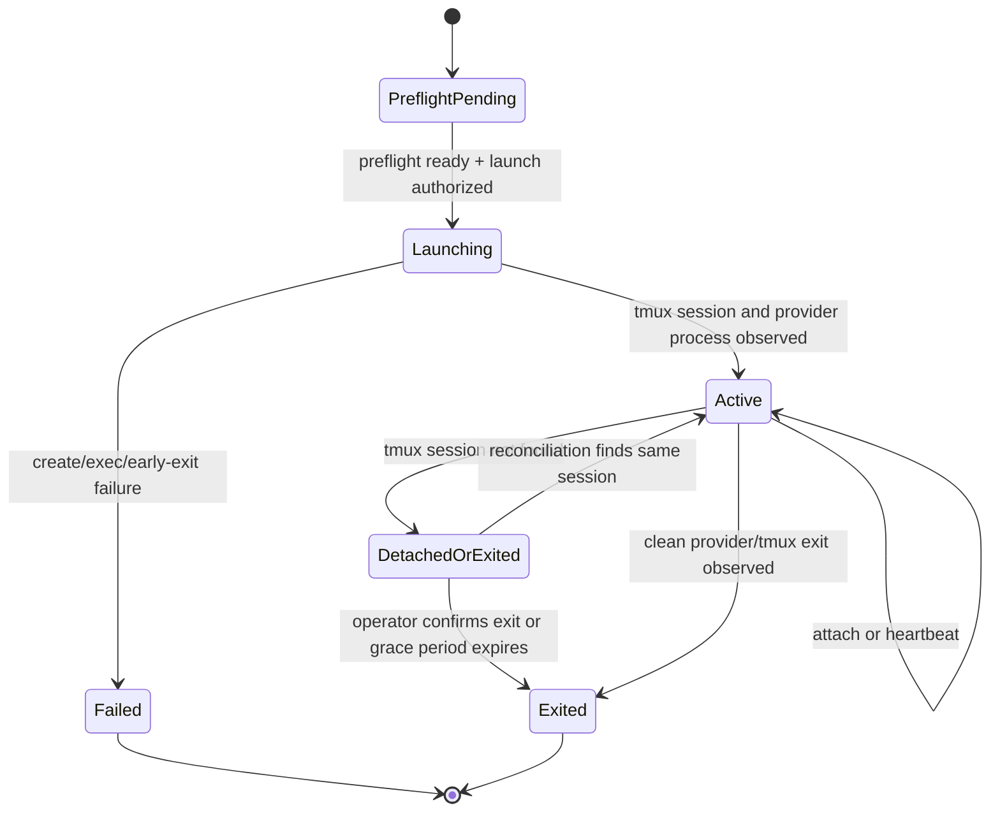
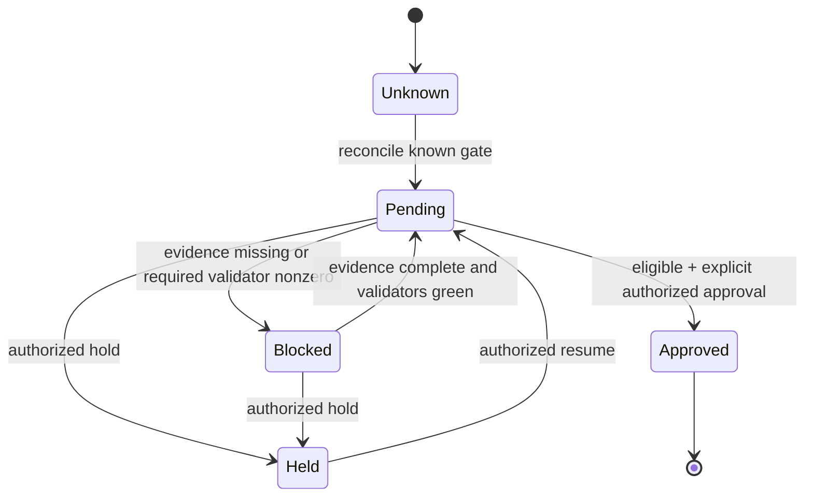
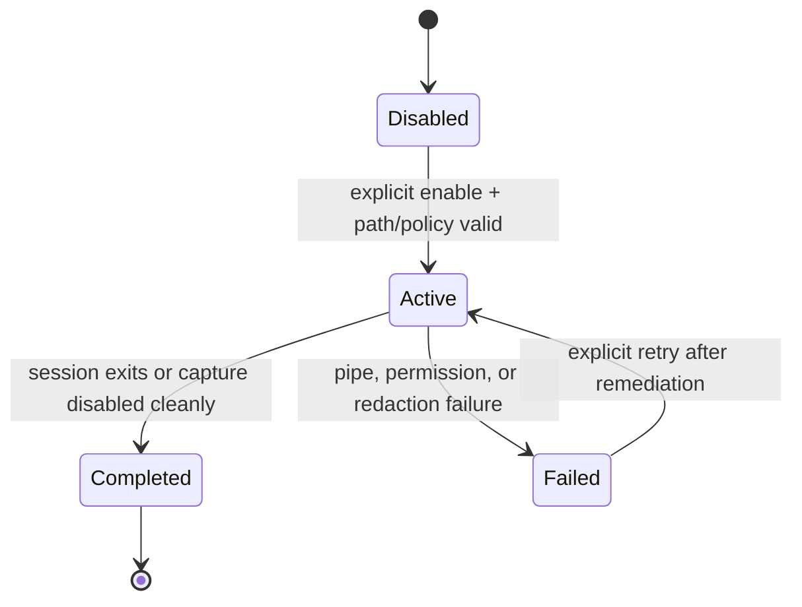

# F0001 Workflow Design

## Principles

- Snapshot state is a projection; append-only events are the audit record.
- Unknown or unreadable state fails closed.
- Reconciliation observes tmux/filesystem facts but does not infer provider or lifecycle approvals from terminal content.
- A user action, authorization result, guard evaluation, state transition, event append, and snapshot revision form one application operation.

## 1. Session Lifecycle

| Transition | Guard | Event | Failure code |
|------------|-------|-------|--------------|
| `PreflightPending -> Launching` | tmux ready; selected provider ready; paths contained; run/tmux IDs unique; `Launch` allowed | `LaunchRequested` | `PREFLIGHT_BLOCKED`, `CONFLICT`, `FORBIDDEN` |
| `Launching -> Active` | tmux reports session; provider entry helper reached exec boundary | `RunLaunched` | `PROVIDER_START_FAILED` |
| `Launching -> Failed` | tmux create, descriptor validation, or provider start fails | `LaunchFailed` | `COMMAND_FAILED` |
| `Active -> DetachedOrExited` | two probes separated by grace interval cannot find tmux session | `SessionMissing` | none; observed transition |
| `DetachedOrExited -> Active` | exact recorded session reappears; no alternate process launched | `SessionRecovered` | `SESSION_MISMATCH` |
| `* -> Active` by attach | forbidden | none | `INVALID_TRANSITION` |

Attach is not a state transition. It appends `SessionAttached` after the existing tmux session is resolved. A missing session returns `SESSION_NOT_FOUND` and never launches a replacement.

## 2. Gate Lifecycle

### Approval Eligibility

All of the following must be true at the fresh snapshot revision:

1. Gate ID is recognized by the selected action contract.
2. Every required evidence path exists, is readable, and has acceptable freshness.
3. Every required validator has a latest result for the current relevant revision and exit code 0.
4. Gate status is `Pending`.
5. Subject is authorized for `DecideGate` with decision `Approve`.
6. The operator explicitly confirms the gate ID, evidence summary, and revision.

Failure appends `GateDecisionBlocked` or `AuthorizationDenied`; it does not create a decision record. `Hold` requires a non-empty reason. `Approve` is idempotent only when the same gate, revision, actor, and decision already exist.

## 3. Transcript Lifecycle

Enablement checks `ConfigureTranscript` authorization, owner-only file creation, path containment, and redactor readiness. The pipe process retains a bounded overlap so secret patterns split across input chunks are still detected. Only redacted bytes are appended. An ordinary redaction/pipe failure closes the output, marks capture `Failed`, and leaves attach available. A terminal capture failure persists a bounded sanitized `failure_reason`; no raw output or exception text is stored. Completion disables the external pipe only as part of a compensatable operation, and restart reconciliation consumes both `completed` and `failed` worker sidecars so durable state cannot remain `Active` after capture has stopped. Timeout, nonstandard exit, or malformed liveness output is unresolved rather than inactive. If capture cannot be proved stopped and a truthful durable `Active` compensation also cannot be published or recovered, the privacy fail-safe terminates the immutable owning tmux session and verifies it absent before returning `STATE_IO`; no terminal transcript fact is fabricated.

## 4. Validator Execution

1. Resolve the `validator_key` through a committed allowlist, open the fixed validator script and governed input roots through no-follow descriptors, and build argv from those inherited descriptors rather than caller-controlled paths.
2. Authorize `RunValidator` and verify product-root containment and descriptor identity immediately before execution.
3. Append `ValidatorStarted` with the stable key, not untrusted command text.
4. Execute without a shell, with timeout and bounded output capture.
5. Redact output, write the detailed artifact when configured, then commit the summary and exit code.
6. Append `ValidatorCompleted`, `ValidatorTimedOut`, or `ValidatorCancelled`.
7. Recompute gate eligibility from the new result; do not approve or hold automatically.

Pure `doctor`, `sessions`, `status`, and `evidence` reads do not mutate state. `doctor` may initialize the owner-only runtime directory and records that only when creation occurs.

## 5. Evidence Watcher

- Default interval: 500 ms; duplicate notifications debounce within 100 ms.
- Paths are resolved from known feature/run roots, never from terminal output.
- Observation states: `Pending`, `Available`, `Missing`, `Moved`, `Malformed`, `Denied`, `Stale`.
- The last valid parsed metadata remains visible alongside the new error observation.
- Repeated identical errors update in-memory freshness only; they do not flood the event stream.
- Watcher failure degrades evidence freshness and blocks affected gates but does not terminate the provider session.

## 6. Recovery

1. Validate the snapshot. If invalid, preserve it and select the most recent valid backup snapshot.
2. Validate contiguous events after the snapshot's `last_event_sequence` and deterministically replay them.
3. Probe the exact tmux session recorded for the run.
4. Reconcile session state without starting a process.
5. Reconcile evidence observations and transcript readability.
6. Present attach, transcript, and failure-remediation choices; do not auto-approve a gate.

Recovery stops with `STATE_CORRUPT` when no valid snapshot/event prefix exists. It must not fabricate state from terminal screen text.
