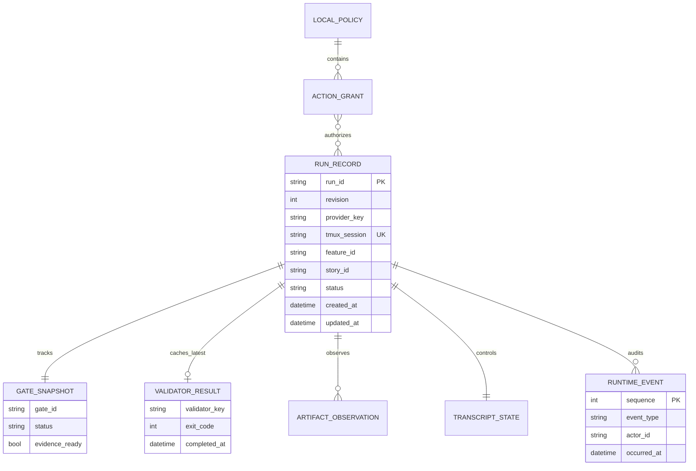
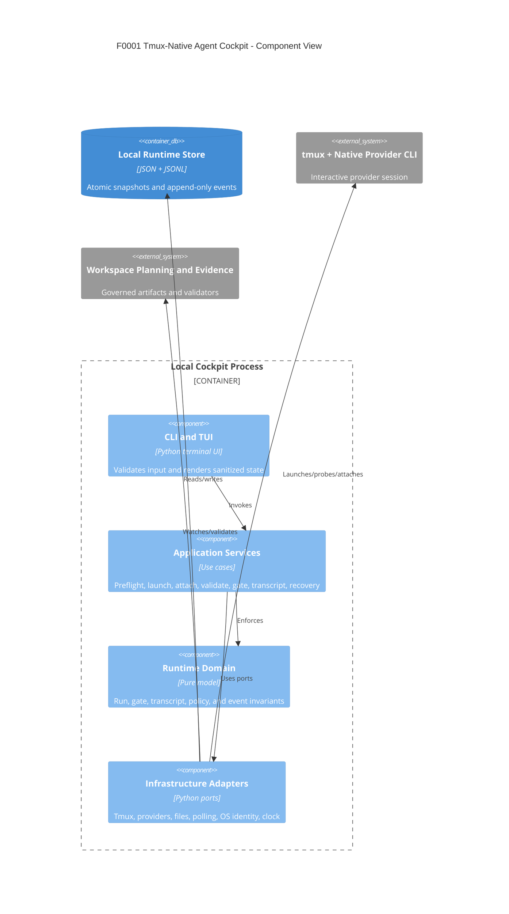

# F0001 - Tmux-Native Agent Cockpit

**Status:** In Progress - G3 remediation active in run `2026-07-14-b885d64c`
**Priority:** Critical
**Phase:** MVP

## Overview

F0001 delivers the first usable terminal UI for Nebula Agents by launching native Codex and Claude Code CLI sessions inside tmux. This preserves subscription-authenticated shells, native interactive prompts, gated approvals, and full terminal context while Nebula adds preflight checks, run tracking, evidence visibility, validation status, transcript capture, and recovery commands around the session.

## Documents

| Document | Purpose |
|----------|---------|
| [PRD.md](./PRD.md) | Full product requirements for the tmux-native cockpit |
| [STATUS.md](./STATUS.md) | Delivery checklist and signoff tracking |
| [GETTING-STARTED.md](./GETTING-STARTED.md) | Developer and agent setup guide |
| [CLI contract](../../architecture/f0001-cli-contract.md) | Versioned command, JSON output, error, and exit-code contract |
| [Workflow design](../../architecture/f0001-workflows.md) | Session, gate, and transcript state machines |
| [Data model](../../architecture/data-model.md) | Runtime records, persistence, and ERD |

## Stories

| ID | Title | Status |
|----|-------|--------|
| [F0001-S0001](./F0001-S0001-provider-auth-and-environment-preflight.md) | Provider auth and environment preflight | Implemented; G3 blocked |
| [F0001-S0002](./F0001-S0002-tmux-session-launch-and-attach.md) | Tmux session launch and attach | Implemented; G3 blocked |
| [F0001-S0003](./F0001-S0003-run-registry-and-evidence-watchers.md) | Run registry and evidence watchers | Implemented; G3 blocked |
| [F0001-S0004](./F0001-S0004-gate-and-validator-dashboard.md) | Gate and validator dashboard | Implemented; G3 blocked |
| [F0001-S0005](./F0001-S0005-native-session-transcript-and-recovery.md) | Native session transcript and recovery | Implemented; G3 blocked |
| [F0001-S0006](./F0001-S0006-readonly-review-and-status-commands.md) | Read-only review and status commands | Implemented; G3 blocked |

**Total Stories:** 6
**Implemented:** 6 / 6
**Lifecycle Closed:** 0 / 6 (G3 remediation and G4-G8 pending)

## Operator Interaction Model

`launch` creates and records exactly one native provider process in tmux, then prints the run ID and exact `tui --run-id` and `attach --run-id` next commands. It does not auto-attach. The TUI is the cockpit projection; `attach` enters the native provider terminal. `NEBULA_AGENTS_PRODUCT_ROOT` allows every installed command to resolve this product from outside the repository, with cwd retained as the fallback.

## Architecture Review

**Phase B status:** Complete and approved at `2026-07-13T21:39:29-04:00`
**Execution Plan:** Created and validated by the `feature` action at G0 in `feature-assembly-plan.md`.

### Key Findings

- The first version must prefer `tmux + native CLI` over provider SDK calls because the primary product risk is loss of interactivity and subscription auth.
- The cockpit should observe and organize the native session; it should not reinterpret provider prompts or hide approval moments.
- F0002 can introduce provider adapters later, but F0001 remains the fallback behavior until managed orchestration proves parity.
- F0001 is one local Python process with no daemon, database, HTTP API, or MCP surface.
- Current state uses an atomic JSON snapshot; immutable history uses a per-run JSONL stream.
- F0003 owns artifact indexing, summaries, metrics, MCP queries, and reviewed learning so those concerns do not expand the cockpit MVP.

### Feature Data Model



```text
LocalPolicy --< ActionGrant >-- RunRecord
                              |-- GateSnapshot
                              |-- latest ValidatorResult
                              |-- ArtifactObservation(s)
                              |-- TranscriptState
                              `-- RuntimeEvent(s), append-only
```

### Component View


